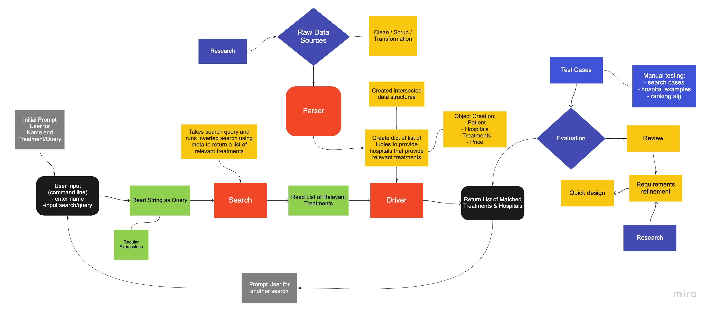

# CourseProject

## Search System For Hospital Transparency Data
Tony Law, Morgan Whitman, Aareana Reze

Healthcare costs make up one of individuals and employers largest expenses and prices continue to rise. New legislation in recent years has required hospitals to provide standard prices on a publicly available websites. This data is accessible on hospital or health system websites but not easily accessible to individuals searching by service. 

This project allows users to query/search medical services and returns a list of relevant treatments and hospitals with these reported services. Our code also has the additional functionality to input a city and limit the results of the search to hospitals within a certain city. We opted to comment out this due to the limited dataset. 

See below for the general flow of our code. 

### Dataset  

* dolthub Hospital Price Transparency [link](https://www.dolthub.com/repositories/dolthub/hospital-price-transparency)
* Kaggle Dataset hospital-price-transparency [link](https://www.kaggle.com/natesutton/hospitalpricetransparency?select=concept.csv)

Due to the limitations of the dataset we used, our search was limited to hospitals in North Carolina. There significantly larger datasets available but they also needed to be purchased or granted access. 